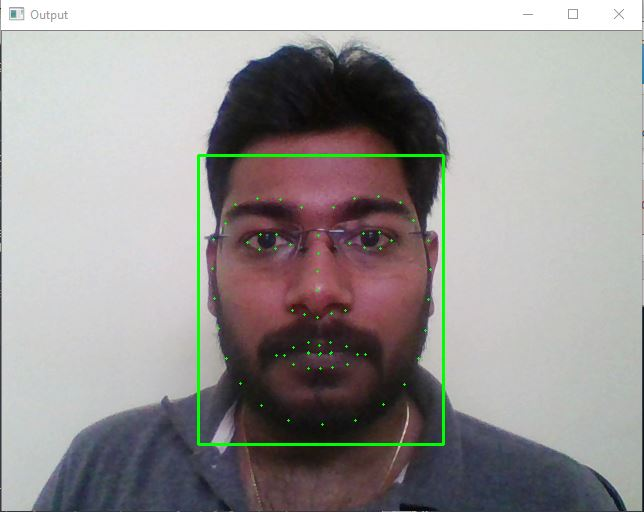
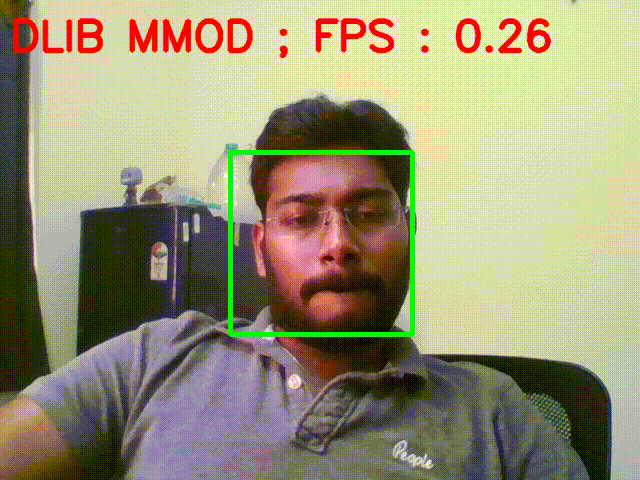

# FindingBestFaceRecognition
Finding best face Recognition &amp; Comparison for further use to pass to neural network.

I have checked the best 4 face detectors for deep learning and posting my outputs below. 

### Out of 4 best face detector is Deep Learning based Face Detector in OpenCV.

- Haar Cascade Face Detector in OpenCV
- Deep Learning based Face Detector in OpenCV
- HoG Face Detector in Dlib 
- Deep Learning based Face Detector in Dlib

HoG Face Detector in Dlib
Using shape_predictor_5_face_landmarks.dat

Using shape_predictor_68_face_landmarks.dat (can download from http://dlib.net/files/shape_predictor_68_face_landmarks.dat.bz2)

For more info

We can't use for long distance or limitation is like can't go below than 80*80

Deep Learning based Face Detector in Dlib
Using mmod_human_face_detector.dat

If you observe the frame rate it is very less i.e., each frame is processing for 3 to 4 sec. Can't be useful for slow processing power. I will try to keep jupyter notebook for this to show the time it is taking to find face(s) in each frame.

Haar Cascade Face Detector in OpenCV
Using haarcascade_frontalface_default.xml 
 

Deep Learning based Face Detector in OpenCV
Using res10_300x300_ssd_iter_140000_fp16.caffemodel & deploy.prototxt
